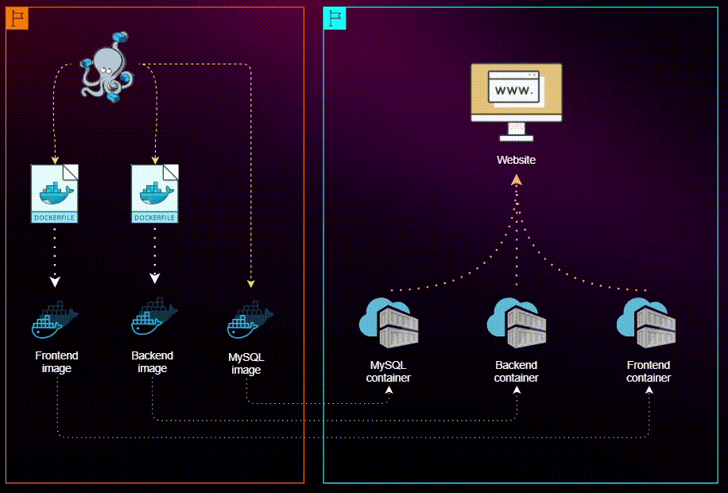

# Three-Tier Application Deployment


Deploy a three-tier full stack application using **Docker Compose** or **Dockerfiles**, consisting of a MySQL database, a Node.js backend, and a React.js frontend.



---

## 📋 Overview

This repository demonstrates two methods for deploying a three-tier application:

- **Docker Compose**: Simplifies managing multi-container deployments.
- **Dockerfiles**: Offers fine-grained control over each component.

---

## 📦 Prerequisites

Ensure you have the following installed:

| Tool          | Installation Link |
|---------------|-------------------|
| **Docker**    | [Get Docker](https://www.docker.com/get-started) |
| **Docker Compose** (for Docker Compose method) | [Install Docker Compose](https://docs.docker.com/compose/install/) |

---

## 🚀 Deployment Methods


### Method 1: Dockerfiles

#### Project Structure

```
project-root/
│
├── frontend/   # React.js frontend application
├── backend/    # Node.js backend application
└── mysql/      # MySQL Dockerfile and configurations
```

#### Steps

1. **Set Up MySQL**
   ```bash
   cd mysql
   docker build -t mysql-image .
   docker run --name mysql-container --network=three-tier-network -p 3306:3306 -v mysql-data:/var/lib/mysql -d mysql-image
   ```

2. **Initialize Database**
   ```bash
   docker exec -it mysql-container /bin/bash
   # Inside the container:
   mysql -u root -p
   USE school;
   CREATE TABLE student (id INT AUTO_INCREMENT PRIMARY KEY, name VARCHAR(40), roll_number INT, class VARCHAR(16));
   CREATE TABLE teacher (id INT AUTO_INCREMENT PRIMARY KEY, name VARCHAR(40), subject VARCHAR(40), class VARCHAR(16));
   ```

3. **Set Up Backend**
   ```bash
   cd backend
   docker build -t backend .
   docker run -d -p 3500:3500 --name backend-container --network=three-tier-network backend
   ```

4. **Set Up Frontend**
   ```bash
   cd frontend
   docker build -t frontend .
   docker run -d --name frontend-container --network=three-tier-network -p 80:80 frontend
   ```

5. **Access the Application**
   - Open [http://localhost:80](http://localhost:80) in your browser.

### Method 2: Docker Compose

#### Project Structure

```
project-root/
│
├── frontend/             # React.js frontend Dockerfile and files
├── backend/              # Node.js backend Dockerfile and files
├── docker-compose.yml    # Docker Compose configuration
├── student-teacher-app/  # Frontend application code
└── backend/              # Backend application code
```

#### Steps

1. **Clone the Repository**
   ```bash
   git clone <repository-url>
   cd <repository-directory>
   ```

2. **Build and Run Containers**
   ```bash
   docker-compose up -d
   ```

3. **Access the Application**
   - Open [http://localhost:80](http://localhost:80) in your browser.


---

## 💾 Data Persistence

Data persistence is managed through Docker volumes. This ensures that even if the MySQL container is removed, your data remains intact and is preserved in a Docker volume. When a new container is created with the same volume, it will automatically reattach the stored data, maintaining continuity and reliability.


---

## 📝 Conclusion

Feel free to explore and modify the Docker Compose configurations or Dockerfiles to deepen your understanding of containerization and deployment. Happy coding! 🚀
```

This format maintains a clear structure, uses collapsible sections for detailed instructions, and is designed to be engaging and easy to navigate.
